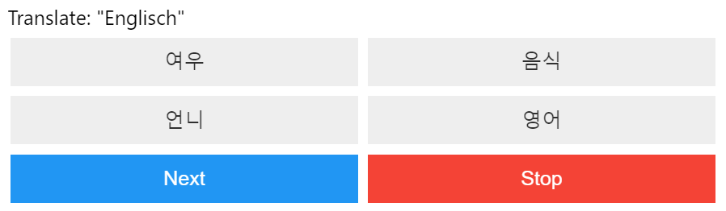

# Overview

This is a simple vocabulary trainer using a Jupyter notebook.
It requires an Excel with one column each for words and their translations.
The underlying idea is that, since I personally find it helpful to type the words I'm learning,
I might as well use the resulting Excel to query myself on vocabulary.

As of now, the project is designed for German/English to Korean translations, which is reflected in the code.
However, with some basic Python knowhow, it shouldn't be too hard to modify the code to support your specific needs.

# Expected Excel file format

Since the project is currently designed explicitly for mostly German to Korean vocabulary, columns "Deutsch" and "한국어" are expected.
Furthermore, since my specific Excel aggregates multiple sheets\* in the Excel into one combined sheet using Power Query,
the sheet needs to be specified and defaults to "Gesamt".

Example of sheet layout:

| Deutsch     | 한국어 |
| ----------- | ------ |
| Deutschland | 독일   |
| Korea       | 한국   |

(\* I have separate sheets depending on where I learned that word.
For example, I mostly learn with a textbook, but I supplement that with Duolingo, and I sometimes stumble
across new vocabulary elsewhere. Thus, that's three different sheets, which are then aggregated.)

# How to setup

Basic knowledge of how Python and Jupyter Notebooks function is expected for setting up this project;
this naturally includes having Python and (recommended) VS Code installed.

If you're not familiar with these concepts, there are plenty of guides on the web that are much better than what I could explain here.
However, if diving into that is too technical for you / completely out of your wheelhouse, this may not be the right vocabulary trainer tool for you.

With that out of the way, here are the setup instructions:

- Step 1: Create and activate a venv. This is not strictly necessary, but it's highly recommended.
  I used pip, but you can of course use conda as well.
  Make sure to also create a corresponding kernel with that venv.
- Step 2: Run `pip install -r requirements.txt` to install the required packages (or use the corresponding conda command/s).
  `requirements-dev.txt` are only necessary if you plan to contribute to the code base.
  `requirements-mobile.txt` exists for convenience for use on mobile, where I couldn't get the simpleaudio package to work.
  For readability's sake, version numbers are not included in the requirements, but I don't expect major issues here.
  I'd rather have the newest versions of the used packages, instead of fixing the version which I'd realistically rarely update.
- Step 3: In `vocabulary_quiz.ipynb`, which is the main notebook used for the trainer, modify the path to your excel file.
  If necessary, also change the sheet name. If your column names differ, change them in preprocessing.py, `get_dicts_from_df`.
- Step 4: Run the entire notebook.
  The last cell will display the actual quiz in the form of a query asking for a translation, while providing 4 options to choose from.
  Upon selecting an answer, a sound effect and a message in the UI will indicate whether you're correct.
  Select "Next" to continue, or "Stop" to, well, stop and save your results to the subfolder ./quiz_results.
  This historical data will be used on subsequent executions to modify the probabilities that words are chosen,
  for example increasing the probability for words that have not been queried recently or that were previously answered incorrectly.

Here's an example of the quiz UI:

# Contributions

If you want to contribute to the code, please follow these guidelines:

- Format + remove imports with autoflake: `autoflake --remove-all-unused-imports --in-place --recursive .`
- Use isort to sort imports: `isort .`
- Format your code with black: `black .`
- Don't push Notebook outputs; although nbstripout should enforce that anyways, if I have configured it correctly.

# Known issues

The button width is fixed and therefore doesn't support super long text. I don't like fiddling with layouting,
so I just set both button columns to 25% width, which is enough for my purposes.
However, if anyone wants to improve that or make it dynamic, feel free to create a pull request.
Alternatively, you can also just change `button_width` in `widget_entrypoint.py` for a quick fix (but don't push that).

Selection of plausible options is very barebones, but better than entirely random results. If anyone is motivated, there's room for improvement here.
